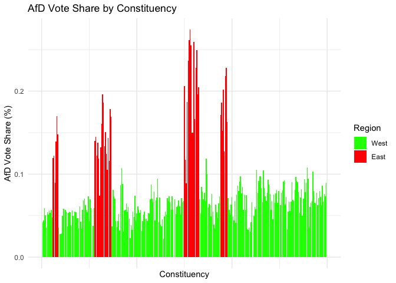
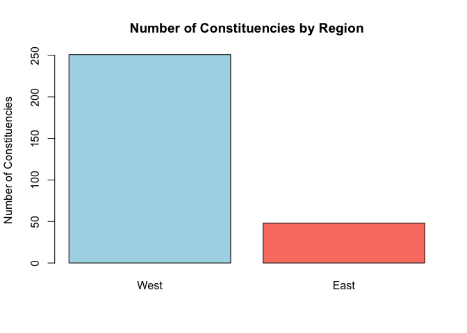
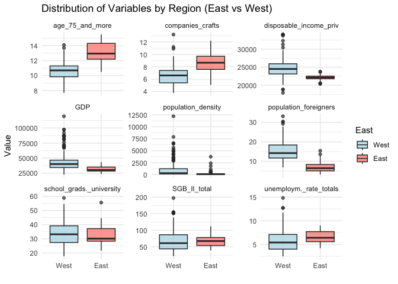
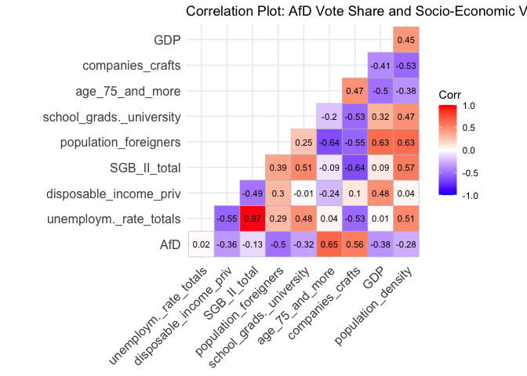
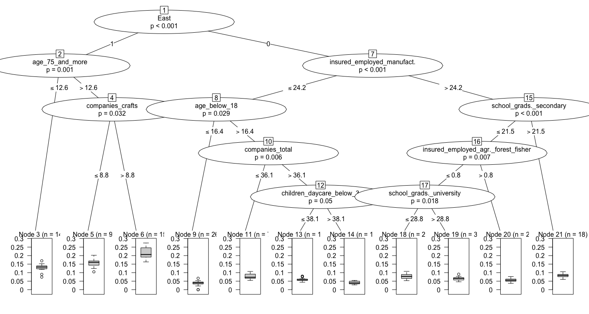
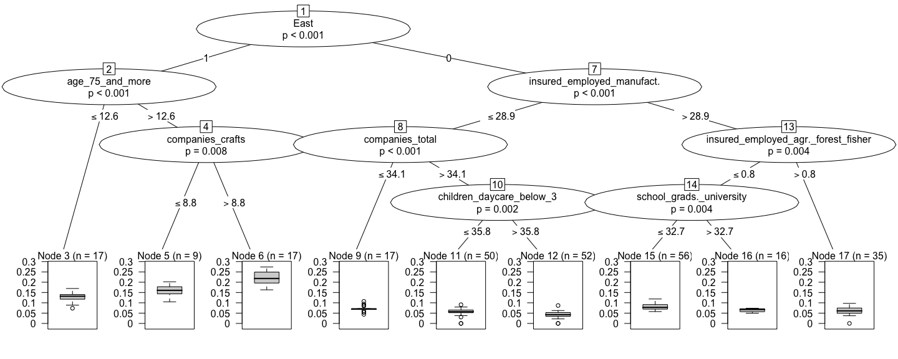
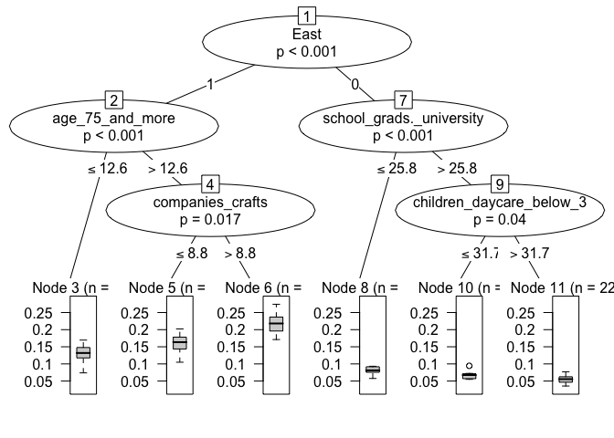
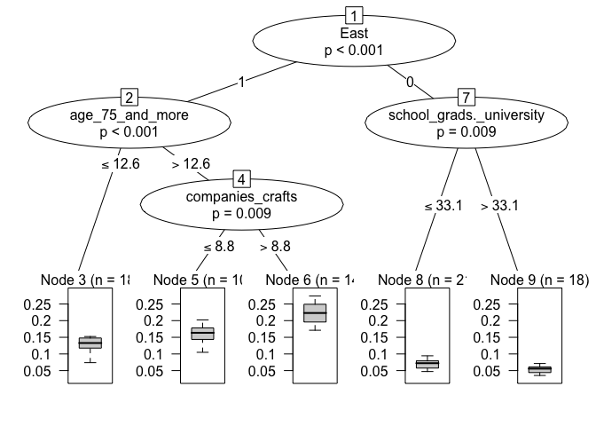

=======
Determinants of AfD Vote Share in the 2025 German Federal Election: A
Structural Analysis Using PrInDTreg and PrInDTRstruc
================
Mohaiminul Islam
2025-10-11

- [1 load data and library](#1-load-data-and-library)
- [2 Tools and methodology](#2-tools-and-methodology)
  - [2.1 Conditional Inference Tree (CI
    Tree)](#21-conditional-inference-tree-ci-tree)
  - [2.2 PrInDTreg & PrInDTRstruc](#22-prindtreg--prindtrstruc)
- [3 Descriptive Analysis](#3-descriptive-analysis)
  - [3.1 Distribution of AfD Vote Share (%) Across Constituencies in
    East and West
    Germany](#31-distribution-of-afd-vote-share--across-constituencies-in-east-and-west-germany)
  - [3.2 Distribution of Constituencies in the East and
    West](#32-distribution-of-constituencies-in-the-east-and-west)
  - [3.3 Socio-Economic and Demographic Differences Between East and
    West
    Constituencies](#33-socio-economic-and-demographic-differences-between-east-and-west-constituencies)
  - [3.4 Correlation Analysis Between AfD Vote Share and Regional
    Socio-Economic
    Characteristics](#34-correlation-analysis-between-afd-vote-share-and-regional-socio-economic-characteristics)
- [4 Regression model without Strucral
  sampling(PrInDTreg)](#4-regression-model-without-strucral-samplingprindtreg)
  - [4.1 model with 95 % C.I
    constrains](#41-model-with-95--ci-constrains)
  - [4.2 model with 99 % C.I
    constrains](#42-model-with-99--ci-constrains)
- [5 Regression with structurcal
  sampling(PrInDTRstruc)](#5-regression-with-structurcal-samplingprindtrstruc)
  - [5.1 Structural defination for sampling with
    PrInDTRstruc](#51-structural-defination-for-sampling-with-prindtrstruc)
  - [5.2 model with 95 % C.I
    constrains](#52-model-with-95--ci-constrains)
  - [5.3 model with 99 % C.I
    constrains](#53-model-with-99--ci-constrains)
- [6 Comparision of results Between PrInDTreg &
  PrInDTRstruc](#6-comparision-of-results-between-prindtreg--prindtrstruc)
- [7 summary](#7-summary)

# 1 load data and library

The dataset used in this analysis was provided by the instructors of the
“Decision tree and their optimization” course at TU Dortmund University
during the winter term 2024/25 which contains contains structural,
demographic, and socio-economic indicators for the 299 constituencies in
Germany during the 2025 federal election. The dependent variable is the
AfD vote share, while the 49 independent variables capture population
structure, education, employment, migration, housing, and welfare AfD’s
share of the votes in each of the 299 constituencies in the 2025 federal
in each constitutions.Most variables are standardized as proportions or
rates, often expressed per 100 inhabitants (percentages) or per 1,000
inhabitants (rates) ie. “age_75_and_more” denotes the percantage of
people in that age group per 10000 inhabitants ([Bundeswahlleiterin
2025](#ref-Bundeswahlleiterin)) . Variables such as GDP and
disposable_income_priv are measured per capita. A categorical variable,
east, denotes whether a constituency is in eastern or western Germany .
This report aims to identify the key factors influencing AfD support in
2025, when the party received the second-highest vote share (20.8%).
([Bundeswahlleiterin 2025](#ref-Bundeswahlleiterin)).

``` r
library(PrInDT)
library(dplyr)
library(ggplot2)
library(dplyr)
library(tidyr)
library(ggcorrplot)

load("Elect25.RData")
Elect_data <- data
```

# 2 Tools and methodology

## 2.1 Conditional Inference Tree (CI Tree)

Conditional inference trees differ from traditional decision trees in
that they use statistical tests of independence to select the most
important variable and determine split points. Let $Y$ be a response
variable and $X = (X_1, \dots, X_m)$ a vector of covariates. The
algorithm can be summarized as follows:

**Variable selection:** Test the global null hypothesis that $Y$ is
independent of the $m$ covariates. If the null hypothesis cannot be
rejected, all covariates are considered independent and the procedure
stops. Otherwise, at least one covariate is associated with $Y$, and the
covariate $X_j^*$ with the strongest association (lowest p-value) is
selected.

**Splitting:** After selecting $X_j^*$, identify the split that best
separates the observations into two groups with distinct responses. The
difference between groups can be evaluated using a two-sample test, such
as a t-test for continuous responses or a permutation test for responses
measured on arbitrary scales.

Steps 1 and 2 are then recursively repeated for each subsequent node
until no significant association is detected. The tree stops growing
when all remaining nodes fail the independence test. A flexible
significance level $\alpha$ can increase the chance of not rejecting the
null hypothesis, thus controlling tree growth. Additionally, a minimum
number of observations per node can be used as a criterion to prevent
further splitting.([Hothorn, Hornik, and Zeileis
2006](#ref-Hothorn2006ctree))

## 2.2 PrInDTreg & PrInDTRstruc

PrInDTreg and PrInDTRstruc use ctrees (conditional inference trees from
the package “party”) for optimal modeling of the relationship between
the target and independent variables. Fundamentally, both of these
functions model the relationship between the target and all other factor
and numerical variables by means of ‘N’ repetitions of subsampling and
produce the best interpretable trees based on the optimization criterion
$R^2$ of the model on the validation sample. Hence, the trees can vary
depending on the sampling technique and the proportion of sampled
observations. Moreover, as they use ctree to model the dependency
structure, the selection of the significance level (C.I.) also plays a
great role in the complexity of the generated trees.

The fundamental difference between PrInDTreg and PrInDTRstruc is in the
sampling technique: PrInDTRstruc uses structural sampling, whereas
PrInDTreg uses simple random sampling. Hence, with PrInDTRstruc, the
problem of unbalanced class observations can be addressed, which may
generalize the relationship between the target and independent variables
with greater accuracy. Additionally, PrInDTRstruc allows flexible
sampling strategies, including subsampling of elements in the
substructure, to predictors, or to combinations of predictors and
substructure elements—allowing for controlled sampling strategies that
may enhance the model accuracy.([Weihs, Buschfeld, and Nitsch
2025](#ref-PrInDT2025))

# 3 Descriptive Analysis

## 3.1 Distribution of AfD Vote Share (%) Across Constituencies in East and West Germany

``` r
ggplot(Elect_data, aes(x = seq_len(nrow(Elect_data)), y = AfD, 
                       fill = factor(East, levels = c(0,1), labels = c("West","East")))) +
  geom_bar(stat = "identity") +
  scale_fill_manual(values = c("East" = "red", "West" = "green")) +
  labs(
    title = "AfD Vote Share by Constituency",
    x = "Constituency",
    y = "AfD Vote Share (%)",
    fill = "Region"
  ) +
  theme_minimal() +
  theme(axis.text.x = element_blank(), axis.ticks.x = element_blank())
```

<!-- -->

From the bar chart, it is observed that the AfD vote share in the 2025
election is substantially higher in the East compared to the West. This
clear regional difference motivates a closer examination of structural
variations between the East and West constituencies to understand the
socio-economic determinants driving this disparity.

## 3.2 Distribution of Constituencies in the East and West

``` r
# Count number of constituencies per region
totals <- table(Elect_data$East)

# Rename 0/1 to West/East
names(totals) <- c("West", "East")

# Bar plot
barplot(totals,
        col = c("lightblue", "salmon"),
        main = "Number of Constituencies by Region",
        ylab = "Number of Constituencies")
```

<!-- -->

``` r
# Print totals
print(totals)
```

    ## West East 
    ##  251   48

Here, it can be seen that the West region has a lot more
constituencies(251) than the East(48) — about three times more which
demonstrates that the West has a larger population, bigger
administrative areas, or more political representation than the East.

## 3.3 Socio-Economic and Demographic Differences Between East and West Constituencies

``` r
vars_to_plot <- c("unemploym._rate_totals", "disposable_income_priv","SGB_II_total","population_foreigners","school_grads._university","age_75_and_more","companies_crafts",
                  "GDP", "population_density")

Elect_data_long <- Elect_data %>%
  pivot_longer(cols = all_of(vars_to_plot), 
               names_to = "Variable", 
               values_to = "Value") %>%
  mutate(East = factor(East, labels = c("West", "East")))

ggplot(Elect_data_long, aes(x = East, y = Value, fill = East)) +
  geom_boxplot(alpha = 0.7) +
  facet_wrap(~Variable, scales = "free_y") +
  labs(x = "", y = "Value", title = "Distribution of Variables by Region (East vs West)") +
  scale_fill_manual(values = c("lightblue", "salmon")) +
  theme_minimal()
```

<!-- -->

As we have observed, the popularity of AfD differs considerably between
the East and West constituencies, and there is also a noticeable
difference in political representation. Here, we compare the
characteristics of these regions across several socio-economic
variables.

From the box plots, it is evident that the East has a higher proportion
of people aged 75 and above and a greater number of craft companies,
suggesting an older demographic and stronger reliance on traditional
industries. By contrast, the West shows higher disposable private income
and GDP, reflecting greater overall prosperity and productivity. The
share of foreigners is markedly higher in the West, while the proportion
of students with university entrance qualifications is similar across
regions, though more dispersed in the West. Unemployment and the
proportion of individuals receiving social benefits (SGB II) are
consistently higher in the East. Population density is more skewed in
the West, highlighting its concentration in metropolitan areas, while
the East remains less dense.

In summary, the East is characterized by an older population, higher
unemployment, and greater social dependency, whereas the West
demonstrates higher wealth, stronger economic activity, greater
diversity, and urban concentration.To further explore the relationships
among these socio-economic factors and their potential link to AfD
support,a correlation plot is examined.

## 3.4 Correlation Analysis Between AfD Vote Share and Regional Socio-Economic Characteristics

``` r
vars_to_plot <- c("AfD", "unemploym._rate_totals", "disposable_income_priv", 
                  "SGB_II_total", "population_foreigners", "school_grads._university",
                  "age_75_and_more", "companies_crafts", "GDP", "population_density")

# Subset the data (replace 'df' with your actual dataframe name)
corr_data <- Elect_data %>% select(all_of(vars_to_plot))

# Compute correlation matrix
corr_matrix <- cor(corr_data, use = "complete.obs")

# Plot correlation heatmap
ggcorrplot(corr_matrix, 
           method = "square",
           type = "lower",
           lab = TRUE,
           lab_size = 3,
           colors = c("blue", "white", "red"),
           title = "Correlation Plot: AfD Vote Share and Socio-Economic Variables",
           ggtheme = theme_minimal())
```

<!-- -->

The correlation plot reveals a strong positive association between AfD
vote share and the proportion of residents aged 75 and above (r = 0.65),
as well as with the number of craft companies (r = 0.56). This suggests
that performed better in regions characterized by an older population
and a stronger presence of traditional industries. In contrast, moderate
negative correlations are observed with disposable income (r = -0.36),
GDP (r = -0.38), and the proportion of foreign residents (r = -0.32),
indicating that wealthier and more diverse areas exhibit lower levels of
AfD support. The negative correlation with population density (r =
-0.28) further implies weaker AfD performance in urbanized regions.
Meanwhile, unemployment (r = 0.02) and the share of SGB II recipients (r
= -0.13) show negligible relationships with AfD vote share, suggesting
that demographic and structural characteristics play a more decisive
role than direct economic hardship in shaping electoral outcomes.

# 4 Regression model without Strucral sampling(PrInDTreg)

In this analysis, we fitted two models using `PrInDTreg`, which models
the target variable without accounting for the structural relationships
inherent in the data. To examine different sampling variations, we
applied permutations of 90%, 80%, and 70% of the observations with 100%,
90%, and 70% of the independent variables. The primary difference
between the two models lies in the confidence interval (C.I.)
constraints. Since both `PrInDTreg` and `PrInDTRstruc` employ *ctree* to
model the target variable, imposing stricter confidence interval
criteria tends to produce trees with smaller depth. Therefore, we used
C.I. levels of 0.95 and 0.99 to construct the models and subsequently
compared their results.

## 4.1 model with 95 % C.I constrains

``` r
outReg_95<-PrInDTreg(Elect_data,"AfD",ctestv=NA,N=999,pobs=c(0.9,0.8,0.7),ppre=c(1,0.9,0.7),
               conf.level=0.95,seedl=TRUE,minsplit=NA,minbucket=NA,valdat=Elect_data)
plot(outReg_95$ctmax)
```

<!-- -->

``` r
print(outReg_95$maxR2)
```

    ## [1] 0.8674749

The regression tree constructed at a **95% confidence level** with
**PrInDTreg** achieved **R² = 0.867** and **MAE = 0.0125**, suggesting
that the model explains about **86.7%** of the variation in **AfD**
support. The model was trained on **70%** of the data and verified on
the rest, obtaining **11 terminal nodes**, each representing a distinct
regional and socioeconomic class. The first and strongest separation is
based on **East (East == 1)**, which confirms that **AfD** support is
much higher in **East Germany**, where historical, economic, and
cultural divides continue to impact political preferences. In Eastern
regions, places with a **lower elderly population (age_75_and_more ≤
12.6%)** form a cluster with relatively moderate **AfD** support, while
those with **more elderly residents (age_75_and_more \> 12.6%)** tend to
exhibit stronger support. **AfD** support is generally higher in older
**East Germany** locations with fewer. **craft companies
(companies_crafts ≤ 8.8%)**. As a result, areas with fewer small,
established firms can experience greater economic insecurity and react
more strongly to populist slogans that promise to defend local
industries and employment. In contrast, Eastern areas with **more craft
companies (companies_crafts \> 8.8%)** show somewhat lower **AfD**
support, suggesting that a stronger presence of small businesses can
reduce sentiment of economic dissatisfaction and political frustration.
The most important factor in **West Germany (East == 0)** is
**industrial employment (insured_employed_manufact. ≤ 24.2%)**,
indicating that areas less dependent on manufacturing are more prone to
**AfD** appeals, probably as a result of weaker local industries and
economic uncertainty. Additionally, the following factors influence
voting behavior in these Western regions: **youth population
(age_below_18)**, **company density (companies_total)**, and **childcare
availability (children_daycare_below_3)**. Stronger **AfD** tendencies
are shown in regions with **lower university education
(school_grads.\_university ≤ 32.7%)** and **higher industrial employment
(insured_employed_manufact. \> 24.2%)**, indicating that education level
continues to be a significant factor in political orientation.

Overall, **AfD** support is highest in **Eastern**, **older**, and
**less-educated** communities with **fewer diversified industries**,
while support is lowest in **Western**, **more urban**, and **educated**
areas. This reflects ongoing divisions based on **region, economy, and
education**.

## 4.2 model with 99 % C.I constrains

``` r
outReg_99<-PrInDTreg(Elect_data,"AfD",ctestv=NA,N=999,pobs=c(0.9,0.7),ppre=c(0.9,0.7),
               conf.level=0.99,seedl=TRUE,minsplit=NA,minbucket=NA,valdat=Elect_data)

plot(outReg_99$ctmax)
```

<!-- -->

``` r
print(outReg_99$maxR2)
```

    ## [1] 0.8519651

**AfD** support, however with a little less accuracy than the **95%
confidence model (R2 = 0.867)**. Compared to the 11-node model at 95%,
this model yielded **9 terminal nodes** after being trained using **90%
of the observations**, suggesting a slightly simpler but still reliable
structure. As before, the most significant split occurs on **East (East
== 1)**, suggesting that **AfD** support is heavily concentrated in
**East Germany**, where long-term economic and social divides continue
to impact political sentiment. In the East, there are smaller clusters
of **AfD** support in areas with a **lower elderly population
(age_75_and_more ≤ 12.6%)** and stronger support in areas with **more
elderly residents (age_75_and_more \> 12.6%)**. This highlights the fact
that age composition highlights conservative voting patterns. **Craft
industry concentration (companies_crafts ≤ 8.8)** is again associated
with increased **AfD** support in these older Eastern communities,
indicating that local economies with minimal diversification may be more
open to populist appeals. The 99% tree simplifies the structure in
comparison to the 95% model by concentrating on the same key factors
with stronger confidence bounds, which increases the stability and
generalizability of the patterns across samples. Industrial employment
**(insured_employed_manufact. ≤ 28.9%)** is still the primary
differentiator in **West Germany (East == 0)**, but the threshold is now
marginally higher than it was previously (**24.2% in the 95% model**),
indicating that **AfD** support has spread even into moderately
industrialized areas. In more industrial parts of **West Germany**
(**insured_employed_manufact. \> 28.9%**), stronger **AfD** support is
linked to **lower levels of university education
(school_grads.\_university ≤ 32.7%)**. This shows that regions with
fewer university graduates are more likely to support right-wing
populist parties, reflecting how education level continues to influence
political preferences.

Comprehensively, the **99% model** offers a clearer, more conservative
perspective of these relationships, confirming that **AfD** support is
most prominent in **older, less-educated, and economically traditional
communities**. This is true even though both models identify **East
Germany**, **age**, **education**, and **industrial structure** as the
strongest predictors.

# 5 Regression with structurcal sampling(PrInDTRstruc)

In this section, we again fitted two models using `PrInDTRstruc`, which
incorporates the inherent structural relationships present in the data.
As observed from the box plot, there is a distinct divergence between
the western and eastern parts of Germany in terms of social,
demographic, and economic characteristics. Furthermore, the western
region is considerably larger than the eastern region, which leads to an
unbalanced class problem. To address this issue, it is essential to
analyze the influence of the AfD while accounting for this imbalance by
adopting a structural sampling strategy. This approach ensures that
observations from both East and West are equally weighted when modeling
the target variable.

In this analysis, we used the `"ver = d"` version of the `PrInDTRstruc`
function, which first samples the elements of the substructure defined
by the parameter `Mit`, and for each of these subsets, performs
subsampling of the predictors specified by the parameter `Pit`. In our
case, the substructure was defined as *East* and *West*, and `Pit` was
set to `(45, 46, 47)`. This means that 45, 46, and 47 observations were
considered for each substructure, and repeated sampling(99) with
different permutations of predictors was employed to model and assess
the influence of the AfD across Germany. Furthermore, consistent with
the previous analysis, we applied confidence intervals of 0.95 and 0.99
to construct and compare the two models.

## 5.1 Structural defination for sampling with PrInDTRstruc

``` r
name<-as.factor(1:299)
check <- "Elect_data$East"
          
labs <- matrix(nrow=2,ncol=1)
labs[1] <- "0"
labs[2] <- "1"

rownames(labs) <- c("West Germany","East Germany")
Struc <- list(name=name,check=check,labs=labs)
```

## 5.2 model with 95 % C.I constrains

``` r
outstruc_95 <- PrInDTRstruc(Elect_data,"AfD",Struc=Struc,vers="d",
                  M=99,Mit=c(45,46,47),N=99,Pit = c(45,46,47),conf.level=0.95)

 plot(outstruc_95$outmax$ctmax)
```

<!-- -->

``` r
print(outstruc_95$R2max)
```

    ## [1] 0.8223903

As observed in the descriptive analysis, the East–West divide emerges as
a highly influential determinant—a pattern also reflected in the
conditional inference tree model. By design, the model splits the data
into these regional groups to maximally reduce the variance in AfD vote
shares, with the first split occurring between East and West, indicating
that regional affiliation alone explains a substantial portion of the
overall variation in voting behavior. In general, AfD support is
substantially higher in the East compared to the West, regardless of
other determinants. Within the East, constituencies with a lower share
of residents aged 75 years and older (*Node 3*) show the lowest AfD
percentages, whereas regions with a higher proportion of elderly
residents (above 12.6%) and a larger share of craft companies exhibit
the highest AfD popularity (*Node 6*). Districts with both an older
population and a strong presence of craft enterprises typically
represent rural or small-town areas. Hence, AfD tends to be more popular
in rural areas than in metropolitan ones within the East. However, in
the western part of Germany, there is a linearly decreasing relationship
between educational attainment and childcare facilities. Regions with a
lower share of individuals holding university entrance qualifications (≤
25.8%) show the highest AfD support (Node 8). In contrast, regions with
higher educational attainment but lower availability of childcare
facilities for children under three years old (≤ 31.7%) also tend to
show relatively elevated AfD support, though to a lesser extent. This
suggests that both lower education levels and limited childcare
infrastructure are associated with stronger AfD preferences in the West.

## 5.3 model with 99 % C.I constrains

``` r
outstruc_99 <- PrInDTRstruc(Elect_data,"AfD",Struc=Struc,vers="d",
                  M=99,Mit=c(45,46,47),N=99,Pit = c(45,46,47),conf.level=0.99)

plot(outstruc_99$outmax$ctmax)
```

<!-- -->

``` r
print(outstruc_99$R2max)
```

    ## [1] 0.8094153

In comparison with the tree estimated under a 95% confidence interval,
this tree with a 99% confidence interval exhibits a similar pattern in
AfD vote share determinants but with a reduced tree depth. The East–West
divide continues to be the most influential factor, with an identical
tree structure observed for the East. However, in the West, the variable
representing childcare facilities for children under three years old
(children_daycare_below_3) is excluded, leaving educational attainment
as the sole significant determinant which suggests that regions with a
lower share of individuals (\<33.1%) holding university entrance
qualifications show higher AfD support (Node 8) compared to regions with
a higher proportion of individuals possessing such educational
qualifications.

In comparison of model performance, the tree estimated with a 95%
confidence interval shows a higher ( R ) value (0.8223903) than the tree
constructed with a 99% confidence interval. Although the 99% confidence
tree is more interpretable due to its reduced number of splits and
determinants, the 95% model demonstrates better explanatory power. In
this case, since the 95% tree achieves a higher goodness-of-fit value
and remains sufficiently interpretable, it is selected as the optimal
**PrInDTRstruc** model for this analysis.

# 6 Comparision of results Between PrInDTreg & PrInDTRstruc

Both `PrInDTreg` and `PrInDTRstruc` generate decision trees explaining
AfD vote share based on socio-economic determinants. The East-West
divide is the most significant factor in both methods, with identical
trees for the eastern region.For the western region, `PrInDTreg`
produces a more complex tree due to its sampling approach. Since our
dataset is highly imbalanced, with more entries for the west than the
east, the randomly sampled data (`pobs`) is skewed toward the west,
whereas `PrInDTRstruc` uses the same amount of data for each region.
Consequently, `PrInDTreg` models a higher proportion of western data
than `PrInDTRstruc`, resulting in additional splits and variables that
better capture AfD voting patterns in the west.`PrInDTreg` includes
additional determinants such as `"companies_total"`,
`"insured_employed_manufacture"`, and
`"insured_employed_agr._forest_fisher"`, while both methods include
`"school_grads_university"` and `"children_day_care_below_3"`.

The goodness-of-fit (R²) is higher for `PrInDTreg` (0.852) than for
`PrInDTRstruc` (0.822), indicating a better model fit. However, in terms
of interpretability, `PrInDTRstruc` is superior, making it easier to
explain results.

# 7 summary

This analysis examined the influence of various demographic and
socio-economic characteristics on the AfD vote share in the 2025
election using the `PrInDTreg` and `PrInDTRstruc` functions. The
descriptive analysis showed that the AfD vote share is considerably
higher in the East compared to the West, alongside several community and
economic traits that differ between the two regions. To further explore
these relationships, a correlation analysis was conducted between AfD
vote share and these determinants to assess their influence beyond
geographic location. Additionally, two models were employed: one using
simple random sampling (`PrInDTreg`) and another using structural
sampling (`PrInDTRstruc`) to capture the effects of various social,
economic, demographic, and educational factors on AfD popularity.

Both models identify the East as the region most favorable to the AfD,
with rural and small-town areas serving as their primary sources of
support. In contrast, in the West, multiple factors contribute to
explaining AfD popularity, which is generally much lower than in the
East.Finally, a comparison of the models’ performance shows that
`PrInDTreg` achieved higher predictive power but lower interpretability,
whereas `PrInDTRstruc` offered greater explanatory insight at the cost
of predictive accuracy.


<div id="refs" class="references csl-bib-body hanging-indent"
entry-spacing="0">

<div id="ref-Bundeswahlleiterin" class="csl-entry">

Bundeswahlleiterin, Die. 2025. “The Federal Returning Officer.” 2025.
<https://www.bundeswahlleiterin.de/en/bundeswahlleiter.html>.

</div>

<div id="ref-Hothorn2006ctree" class="csl-entry">

Hothorn, Torsten, Kurt Hornik, and Achim Zeileis. 2006. “Unbiased
Recursive Partitioning: A Conditional Inference Framework.” *Journal of
Computational and Graphical Statistics* 15 (3): 651–74.

</div>

<div id="ref-PrInDT2025" class="csl-entry">

Weihs, Claus, Sarah Buschfeld, and Niklas Nitsch. 2025. “PrInDT:
Prediction and Interpretation in Decision Trees for Classification and
Regression.” <https://doi.org/10.32614/CRAN.package.PrInDT>.

</div>

<div id="ref-Bundeswahlleiterin" class="csl-entry">

Bundeswahlleiterin, Die. 2025. “The Federal Returning Officer.” 2025.
<https://www.bundeswahlleiterin.de/en/bundeswahlleiter.html>.

</div>

<div id="ref-Hothorn2006ctree" class="csl-entry">

Hothorn, Torsten, Kurt Hornik, and Achim Zeileis. 2006. “Unbiased
Recursive Partitioning: A Conditional Inference Framework.” *Journal of
Computational and Graphical Statistics* 15 (3): 651–74.

</div>

<div id="ref-PrInDT2025" class="csl-entry">

Weihs, Claus, Sarah Buschfeld, and Niklas Nitsch. 2025. “PrInDT:
Prediction and Interpretation in Decision Trees for Classification and
Regression.” <https://doi.org/10.32614/CRAN.package.PrInDT>.

</div>

</div>
>>>>>>> 2efa62c (mohaiminul_afd_projrct)
